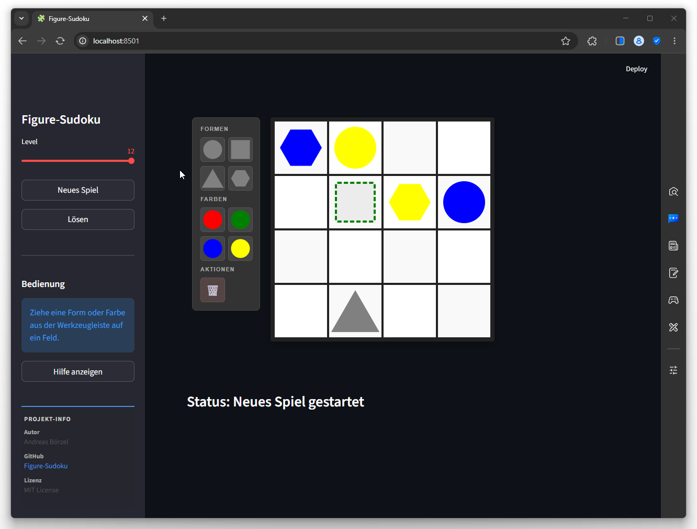

# 🧩 Figure-Sudoku RL-Agent



Dieses Projekt demonstriert den Einsatz von **Reinforcement Learning** (Bestärkendes Lernen), um eine komplexe Sudoku-Variante zu lösen. Anstelle von Zahlen verwendet dieses Sudoku geometrische **Formen** und **Farben**, was die logischen Anforderungen an den Agenten erhöht.

---

## 🎨 Das Spielkonzept

Das **Figure-Sudoku** basiert auf einem 4x4-Gitter. Jedes Feld muss eine eindeutige Kombination aus einer Form und einer Farbe enthalten.

### Die Attribute:
*   **Geometrien:** 🔵 Kreis, 🟥 Quadrat, ▲ Dreieck, ⬢ Hexagon
*   **Farben:** ❤️ Rot, 💚 Grün, 💙 Blau, 💛 Gelb

### Die Regeln:
1.  Jedes Feld muss eine Figur (Form + Farbe) enthalten.
2.  In jeder **Reihe** und jeder **Spalte** darf jede Form nur einmal vorkommen.
3.  In jeder **Reihe** und jeder **Spalte** darf jede Farbe nur einmal vorkommen.
4.  Jede Kombination (z.B. "Roter Kreis") darf im gesamten Gitter nur einmal existieren.
5.  **Teilvorgaben:** Es ist möglich, dass Felder nur mit einer Form (ohne Farbe) oder nur mit einer Farbe (ohne Form) vorbelegt sind. Der Agent muss dann die jeweils fehlende Komponente logisch korrekt ergänzen.

---

## 🚀 Die KI-Architektur

Der Agent nutzt modernste Deep-Learning-Techniken, um die Spielregeln von Grund auf zu lernen:

*   **Bibliotheken:** Nutzt **Stable Baselines3 (v2.0+)** und **Gymnasium**, die aktuelle Standard-Schnittstelle für Reinforcement Learning.
*   **Algorithmus:** `MaskablePPO` (Proximal Policy Optimization). Dank **Action Masking** lernt der Agent keine ungültigen Züge, was das Training massiv beschleunigt.
*   **CNN (Convolutional Neural Network) mit Residual Blocks (ResNet):** Da Sudoku-Regeln auf räumlichen Abhängigkeiten (Zeilen/Spalten) basieren, nutzt der Agent Faltungsschichten. ResNet-Blöcke helfen dabei, auch tieferliegende Abhängigkeiten ohne Informationsverlust zu lernen.
*   **Observation Space:** Ein 3D-Tensor (10 Kanäle), der One-Hot-kodiert die Positionen aller Formen und Farben repräsentiert (flattened auf 160 Eingänge).
*   **Action Space:** Insgesamt 256 diskrete Aktionen. Jede Aktion entspricht der Kombination aus einer bestimmten Figur (16 Möglichkeiten) und einem Zielfeld (16 Felder).
*   **Action Masking:** Da in jedem Zustand nur wenige der 256 Aktionen regelkonform sind, nutzt das Projekt **Action Masking**. Dies verhindert, dass der Agent ungültige Züge (z.B. doppelte Farbe in einer Reihe) überhaupt in Erwägung zieht. Dies reduziert den Suchraum dramatisch und stabilisiert das Training (siehe Abschnitt [Action Masking](#-action-masking-detailerklärung)).
*   **Curriculum Learning:** Das Training startet bei Level 1 (fast gelöst) und steigert automatisch den Schwierigkeitsgrad bis Level 12 (viele leere Felder), sobald der Agent eine definierte Erfolgsquote (einstellbar über `REWARD_THRESHOLD`) erreicht.
*   **Fortsetzbarkeit:** Das Training erkennt automatisch vorhandene Modelle. Das Start-Level wird primär über `START_LEVEL` in der `config.py` gesteuert. Ist dieser Wert auf `None` gesetzt, wird das Level automatisch aus dem letzten Log-Eintrag (`LOG_FILE_PATH`) ermittelt (mit Fallback auf Level 1).
*   **Rätsel-Generator:** Die Rätsel werden mithilfe eines hochoptimierten Backtracking-Algorithmus generiert (`sudoku_generator.py`). Dieser nutzt die **HCDS-Metrik** (Human-Centric Difficulty System), um gezielt Schwierigkeitsgrade von Level 1 bis 12 zu erzeugen, die das menschliche Schwierigkeitsempfinden abbilden. Er stellt sicher, dass jede Aufgabe eine eindeutige Lösung besitzt. Ab Level 11 werden zudem Teilvorgaben (Partial Shapes) unterstützt.

---

## 🧠 Funktionsweise des Agenten

Der Lösungsprozess folgt einem klassischen RL-Zyklus:

1.  **Beobachtung:** Der Agent sieht das aktuelle 4x4-Gitter als One-Hot-Vektor.
2.  **Maskierung:** Die Umgebung berechnet alle regelkonformen Züge basierend auf den Sudoku-Regeln.
3.  **Entscheidung:** Das neuronale Netz bewertet die validen Aktionen und wählt die Erfolgversprechendste aus.
4.  **Belohnung:** Für jeden korrekten Zug erhält der Agent einen kleinen Reward. Das Lösen des gesamten Rätsels gibt einen großen Bonus.
5.  **Lernen:** Über PPO optimiert der Agent seine Strategie, um die kumulierte Belohnung zu maximieren.

---

## 🧩 Rätsel-Generator & Schwierigkeit (HCDS)

Der neue Generator (`sudoku_generator.py`) basiert auf dem **Human-Centric Difficulty System (HCDS)**. Er wurde speziell optimiert, um das menschliche Schwierigkeitsempfinden in den Level-Stufen 1-12 abzubilden und auch bei hohen Schwierigkeitsgraden eine schnelle Rätsel-Generierung (ca. 3s für Level 12) bei garantierter Eindeutigkeit zu ermöglichen.

### Schwierigkeitsstufen (1-12):
*   **Level 1-10:** Die Schwierigkeit skaliert linear durch das Entfernen von Feldern, bis der Ziel-HCDS-Wert erreicht ist.
*   **Level 11:** Enthält zusätzlich **eine Teilvorgabe** (nur Form oder nur Farbe).
*   **Level 12:** Enthält **zwei Teilvorgaben**.

### Performance-Features:
*   **MRV-Heuristik (Minimum Remaining Values):** Beschleunigt die Eindeutigkeitsprüfung durch intelligente Wahl des nächsten Feldes im Backtracking.
*   **In-Place Backtracking:** Minimiert Speicherallokationen und CPU-Last.
*   **Inkrementelle HCDS-Berechnung:** Effiziente Bewertung der Schwierigkeit während des Generierungsprozesses.

---

## 🛡️ Action Masking (Detailerklärung)

Action Masking ist eine entscheidende Technik für die Effizienz dieses Agenten. Da der Action Space mit **256 Aktionen** sehr groß ist, aber in jedem Spielzustand oft nur **weniger als 5%** der Züge legal sind, würde ein Standard-RL-Agent extrem lange brauchen, um allein die Grundregeln (z.B. "nicht zweimal Rot in eine Spalte") durch reines Ausprobieren (*Trial & Error*) zu lernen.

### Wie es funktioniert:
Bevor der Agent eine Aktion auswählt, berechnet die Umgebung (`FigureSudokuEnv.action_masks()`) einen binären Vektor (die Maske). Für jede der 256 Aktionen wird geprüft:

1.  **Feldbelegung:** Ist das Zielfeld bereits mit einer anderen Figur belegt? (Oder passt die gewählte Figur zu einer bestehenden Teilvorgabe?)
2.  **Figur-Verfügbarkeit:** Wurde die Kombination aus Form und Farbe (z.B. "Blauer Kreis") bereits an einer anderen Stelle im Gitter platziert?
3.  **Sudoku-Constraints (Reihe/Spalte):** Existiert die gewählte Form oder die gewählte Farbe bereits in der Ziel-Reihe oder Ziel-Spalte?

### Warum MaskablePPO?
In einem Standard-PPO-Algorithmus würde der Agent auch ungültige Aktionen wählen, eine negative Belohnung erhalten und dann mühsam lernen, diese Aktionen zu vermeiden.
**MaskablePPO** hingegen nutzt die Maske direkt in der Wahrscheinlichkeitsverteilung der Policy:
*   Ungültige Aktionen erhalten eine Wahrscheinlichkeit von **exakt Null**.
*   Der Agent "sieht" während der Entscheidungsfindung nur die legalen Optionen.
*   **Vorteil:** Das neuronale Netz muss keine Kapazität darauf verschwenden, die harten Regeln des Spiels auswendig zu lernen, sondern kann sich sofort auf die **Lösungsstrategie** konzentrieren.

---

### 📂 Projektstruktur

```text
FigureSudoku/
├── 📄 config.py             # Zentrale Konfiguration (Hyperparameter, Level, etc.)
├── 📄 train.py              # Hauptskript zum Starten des KI-Trainings
├── 📄 figure_sudoku_env.py  # Die Gymnasium-Umgebung (Logik & Rewards)
├── 📄 sudoku_generator.py   # Hochoptimierter Generator mit HCDS-Metrik & Eindeutigkeitsprüfung
├── 📄 sudoku_game.py        # Grafische Desktop-Oberfläche (Tkinter)
├── 📄 streamlit_app.py      # Moderne Web-Applikation (Streamlit)
├── 📄 visualizer.py         # Live-Visualisierung während des Trainings
├── 📄 callbacks.py          # Logik für Curriculum Learning & Modell-Speicherung
├── 📄 shapes.py             # Definitionen der Formen und Farben (Enums)
├── 📁 documentation/        # Projekt-Dokumentation & Videos
└── 📁 output/               # Gespeicherte Modelle, Logs und Checkpoints
```

---

## 🎬 Demo

Hier siehst du den RL-Agenten in Aktion, wie er ein Figure-Sudoku schrittweise löst:

<div align="center">
  <video src="./documentation/solving_sudoku_game.mp4" width="600" controls autoplay loop muted>
    Ihr Browser unterstützt das Video-Tag nicht.
  </video>
  <p><i>Agent beim Lösen eines Figure-Sudokus (RL MaskablePPO)</i></p>
</div>

> **Hinweis:** Falls das Video oben nicht automatisch startet, kannst du es direkt hier ansehen: [Demo-Video öffnen](./documentation/solving_sudoku_game.mp4)

---

## ⚙️ Konfiguration (`config.py`)

Die zentralen Einstellungen des Projekts werden in der `config.py` vorgenommen. Hier eine Übersicht der wichtigsten Parameter:

### 🧩 Generator (Rätsel-Erstellung)
*   `START_LEVEL`: Bestimmt das Start-Level für das Training. Wenn ein Wert (1-12) angegeben ist, wird dieser fest verwendet (manuelles Überschreiben). Ist `None` gesetzt, wird das Level beim Fortsetzen eines Trainings automatisch aus der Log-Datei ermittelt (Fallback: Level 1). [Bereich: `1` bis `12` oder `None`]
*   `MAX_LEVEL`: Das Ziel-Level (höchste Schwierigkeit). [Bereich: `1` bis `12`]

### ⚡ Training & Hyperparameter
*   `NUM_AGENTS`: Anzahl der parallelen Trainings-Umgebungen. [Bereich: `>= 1`]
*   `REWARD_THRESHOLD`: Die benötigte Erfolgsquote (z.B. `0.90` für 90%), um in das nächste Level aufzusteigen. [Bereich: `0.0` bis `1.0`]
*   `CHECK_FREQ`: Intervall (in Schritten), in dem die Erfolgsquote geprüft und Modelle zwischengespeichert werden. [Bereich: `>= 1`]
*   `TOTAL_TIMESTEPS`: Die Gesamtdauer des Trainings (Gesamtzahl der Schritte über alle Agenten). [Bereich: `>= 1`]
*   `MAX_TIMESTEPS`: Maximale Anzahl an Schritten pro Episode. Verhindert Endlosschleifen bei unlösbaren Zuständen.

### 🏆 Belohnungssystem (Rewards)

Das Belohnungssystem ist darauf ausgelegt, den Agenten zu einem effizienten und regelkonformen Lösungsweg zu führen. Es besteht aus drei Hauptkomponenten:

1.  **`REWARD_SOLVED` (Aktuell: `10.0`)**:
    *   **Zweck:** Der "Heilige Gral". Dies ist die maximale Belohnung, die der Agent erhält, wenn das gesamte Gitter regelkonform gefüllt ist.
    *   **Warum dieser Wert?** Er muss deutlich höher sein als die Summe der Einzelzüge, damit der Agent das übergeordnete Ziel (das Lösen) priorisiert. Selbst auf dem höchsten Schwierigkeitsgrad (Level 12) beträgt die Summe aller validen Einzelzug-Belohnungen nur ca. `2.45`, was bedeutet, dass der `REWARD_SOLVED` (10.0) immer noch mehr als das Vierfache davon wert ist. Dies stellt sicher, dass der Agent auch bei komplexen Rätseln stets motiviert bleibt, das Rätsel vollständig zu lösen.

2.  **`REWARD_VALID_MOVE_BASE` (Aktuell: `0.1`)**:
    *   **Zweck:** Belohnung für jeden korrekten Zug.
    *   **Dynamische Skalierung:** Die tatsächliche Belohnung berechnet sich als: `base * (1 + leere_felder / gitter_größe)`.
    *   **Warum diese Logik?** Durch die Skalierung erhält der Agent für Züge auf einem leeren Board (wo es viele Möglichkeiten gibt) eine höhere Belohnung als für Züge auf einem fast vollen Board. Dies motiviert den Agenten, "schwierige" Entscheidungen frühzeitig korrekt zu treffen. Der Basiswert von `0.1` ist klein genug, um "Reward Shaping" zu ermöglichen, ohne das Endziel zu überschatten.

3.  **`REWARD_INVALID_MOVE` (Aktuell: `-0.5`)**:
    *   **Zweck:** Bestrafung für illegale Züge (obwohl diese durch Action Masking weitgehend verhindert werden).
    *   **Warum dieser Wert?** Die Strafe ist moderat negativ gewählt. Da der Agent `MaskablePPO` nutzt, trifft er selten auf ungültige Züge im Action Space, aber die Strafe dient als zusätzliche Absicherung für die Lernstabilität der Policy.

---

## 🖼️ Visualisierung (Training)

Während des Trainings kann der Fortschritt auf zwei Arten visualisiert werden:

*   **Live-GUI:** Wenn `config.RENDER_GUI = True` gesetzt ist, wird der Spielzustand der Agenten live in einem Fenster (`visualizer.py`) angezeigt.
*   **TensorBoard:** Detaillierte Metriken (Reward, Erfolgsquote, Training-Loss) werden geloggt.

---

## 🛠 Setup & Installation

### Voraussetzungen:
*   Python 3.8+
*   Anaconda oder venv (empfohlen)
*   CUDA-fähige GPU (für Training empfohlen, z.B. CUDA 11.8)

### Installation der Abhängigkeiten:

1.  **PyTorch mit CUDA-Support (Beispiel für CUDA 11.8):**
    ```bash
    pip install torch==2.3.1+cu118 torchvision==0.18.1+cu118 torchaudio==2.3.1+cu118 --extra-index-url https://download.pytorch.org/whl/cu118
    ```

2.  **Restliche Anforderungen:**
    ```bash
    pip install -r requirements.txt
    ```

---

## 🏋️ Training starten

Um den Agenten zu trainieren, führe einfach die `train.py` aus. Die Konfiguration kann in der `config.py` angepasst werden (z.B. `NUM_AGENTS` für Parallelisierung).

```bash
python train.py | Tee-Object -FilePath output/SUDOKU/training.log
```

### Monitoring mit TensorBoard:
Während das Training läuft, kannst du den Fortschritt (Erfolgsquote, Reward) live verfolgen. Der Pfad ist in `config.TENSORBOARD_TRAIN_LOG` definiert:
```bash
# Beispiel (standardmäßig):
tensorboard --logdir output/SUDOKU/logs/train --port 6006
```
Öffne dann `http://localhost:6006` in deinem Browser.

---

## 🎮 Spielen & Den Agenten beobachten

Es stehen zwei Oberflächen zur Verfügung, um das Spiel selbst zu spielen oder die KI beim Lösen zu beobachten.

### 🌐 Web-Applikation (Streamlit) - Empfohlen
Eine moderne, interaktive Weboberfläche, die im Browser läuft.
```bash
streamlit run streamlit_app.py
```

### 🖥️ Desktop-Anwendung (Tkinter)
Die klassische Version mit Drag & Drop Funktionalität.
```bash
python sudoku_game.py
```

### Anleitung:
1.  Stelle sicher, dass ein trainiertes Modell im `output`-Ordner liegt (siehe `config.MODEL_PATH`).
2.  Wähle den Schwierigkeitsgrad über den **"Level"-Slider** aus.
3.  Klicke auf **"Neues Spiel"** (oder generiere ein neues Rätsel).
4.  Klicke auf **"Lösen"**, um den Agenten beim Lösen zuzusehen, oder spiele selbst!

---

## 📊 Visualisierung des Trainings (Live)
Wenn in der `config.py` der Parameter `RENDER_GUI = True` gesetzt ist, öffnet das Training für jeden Agenten ein eigenes Fenster (`visualizer.py`). So kannst du live beobachten, wie die KI verschiedene Strategien ausprobiert.

---

## 📄 Lizenz & Autor

*   **Autor:** Andreas Börzel
*   **GitHub:** [Figure-Sudoku](https://github.com/aboerzel/FigureSudoku)
*   **Lizenz:** [MIT License](LICENSE) (oder siehe Dateikopf)

*Entwickelt als Experimentierfeld für Reinforcement Learning in komplexen Constraint-Umgebungen.*
